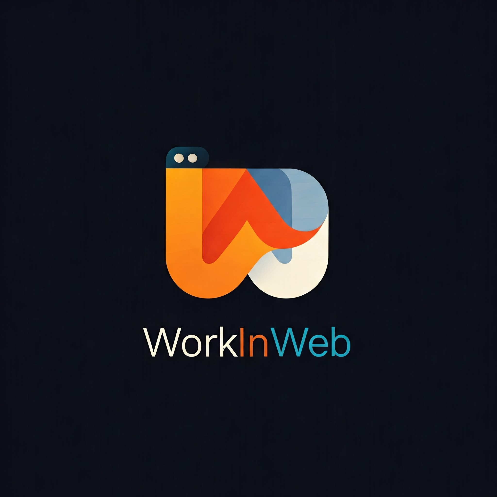

# WorkInWeb - Professional Web Development Agency

A modern, fast, and SEO-optimized web development agency website built with Astro, React, and TailwindCSS. Featuring dark mode, smooth animations, and a responsive design.

## ✨ Features

- 🚀 **Built with Astro** - Ultra-fast performance
- ⚛️ **React Components** - For interactive UI elements
- 🎨 **TailwindCSS** - For beautiful, responsive styling
- 🌙 **Dark Mode** - Automatic and manual theme switching
- 📱 **Fully Responsive** - Works on all devices
- 🔍 **SEO Optimized** - Meta tags and structured data
- 📊 **Template Showcase** - Filterable portfolio gallery
- 📬 **Contact Form** - With email integration
- 🎭 **Smooth Animations** - Using Framer Motion
- 🖼️ **Lottie Animations** - For engaging visual elements

## 🛠️ Tech Stack

- [Astro](https://astro.build)
- [React](https://reactjs.org)
- [TailwindCSS](https://tailwindcss.com)
- [Framer Motion](https://www.framer.com/motion)
- [TypeScript](https://www.typescriptlang.org)
- [Lucide Icons](https://lucide.dev)
- [LottieFiles](https://lottiefiles.com)

## 🚀 Quick Start

1. **Clone the repository**
2. **Install dependencies**
3. **Start development server**
4. **Build for production**

## 🎯 Key Features

### 💼 Template Showcase

- Filterable gallery of web templates
- Category-based filtering
- Search functionality
- Responsive grid layout
- Smooth animations

### 🌙 Dark Mode

- Automatic theme detection
- Manual theme toggle
- Persistent preference storage
- Smooth transition effects

### 📱 Responsive Design

- Mobile-first approach
- Adaptive layouts
- Touch-friendly interactions
- Optimized images
